# Gestion fichier xml 
> Ce projet consiste à gérer des programmes de cinéma, des examens et des fiches de restaurant. 
On a deux profils : un administrateur, qui peut créer des fichiers représentant chacun un programme de cinéma, une description de restaurant ou un examen et qui sont valides par rapport aux DTD/Schémas et un visiteur qui peut visualiser un programme de cinéma, une description de restaurant ou un examen.

# XML's screenshots
## Examen
      DTD
  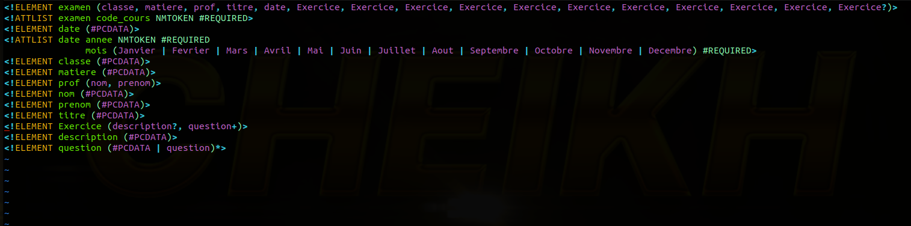
  
     Schéma
  
  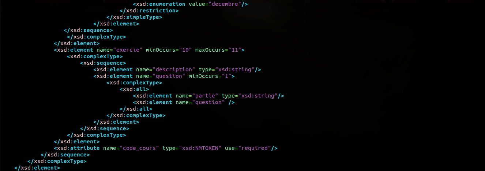
  
## Cinéma
      DTD
  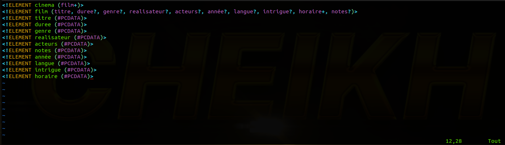
  
      Schéma
  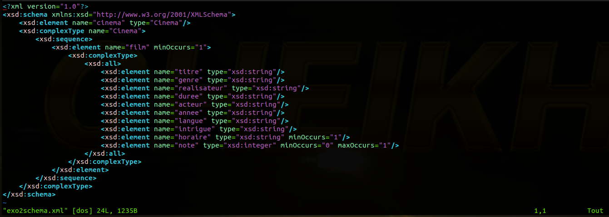

## Portail restaurant 
    DTD
  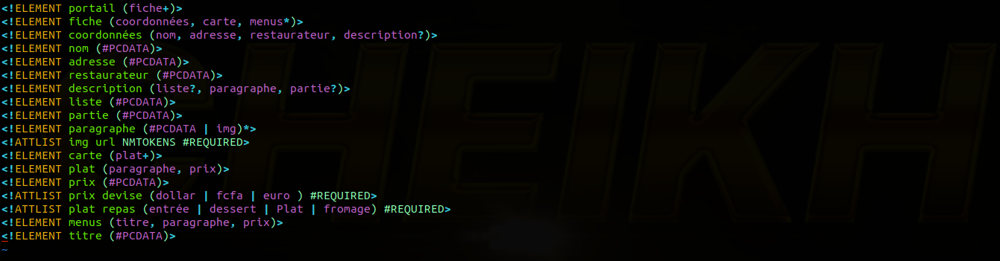
  
      Schéma
  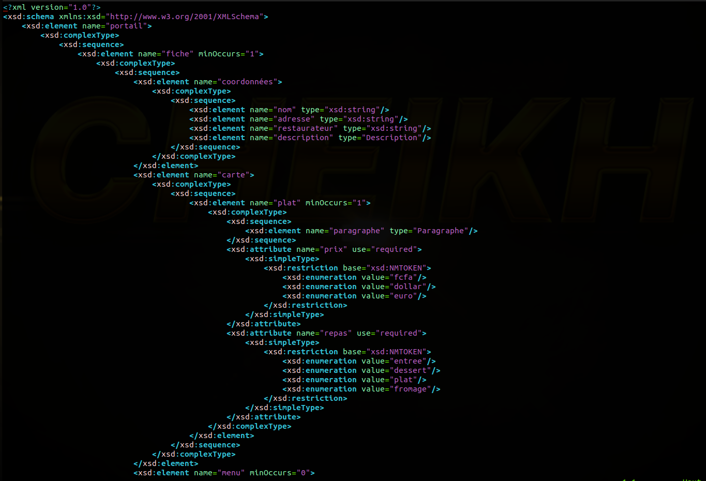
  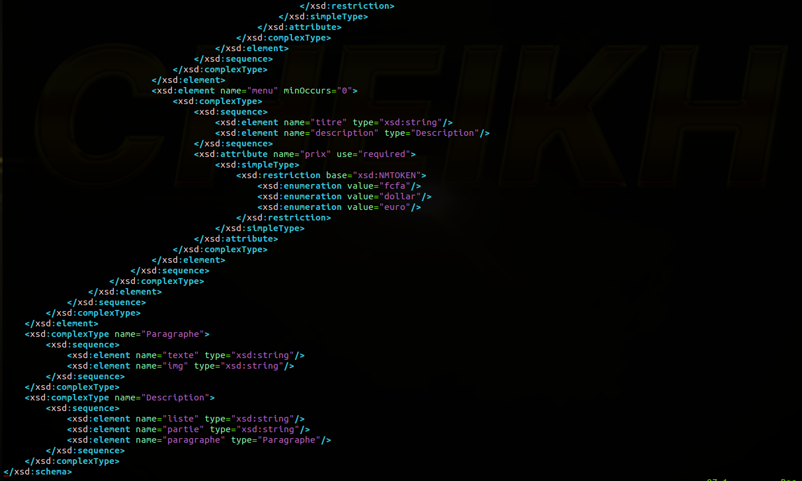

# Result's screenshots
## Examen
> Ici on a le formulaire de création d'un examen contenant des informations générales sur l'examen et la liste des exercices.

  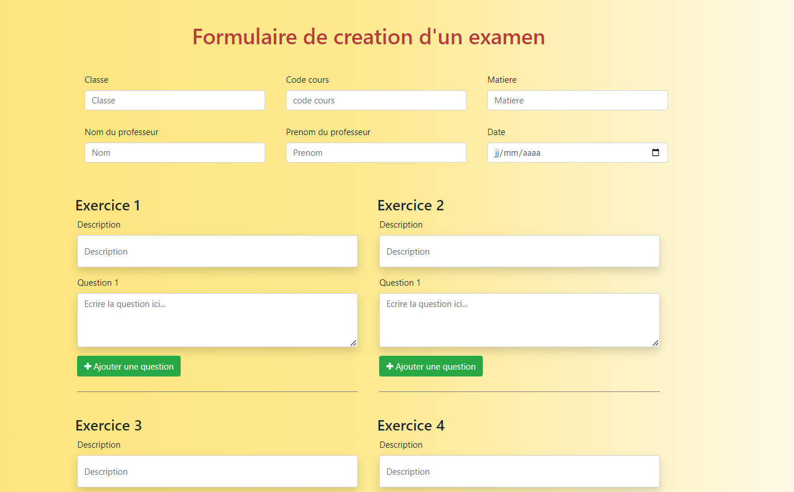
  
> On voit que pour un exercice donné, on peut avoir un à plusieurs questions. On peut pas avoir plus de 11 exercices. Les dix premiers exercices sont obligatoires tandis le onzième est optionnel.

  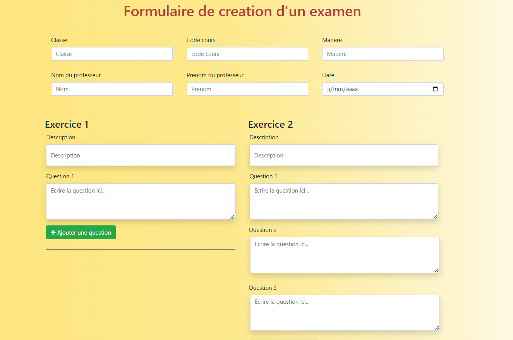
  
> C'est là où on affiche la liste des examens disponibles. On en choisi un et on le visualise.

  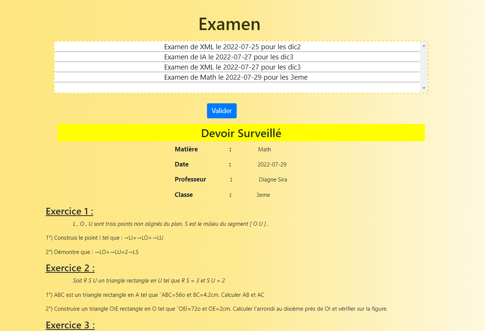
  
## Cinéma 
> Ceci est le formulaire de création d'un programme de cinéma contenant toutes les informations nécéssaires relatives au film.

  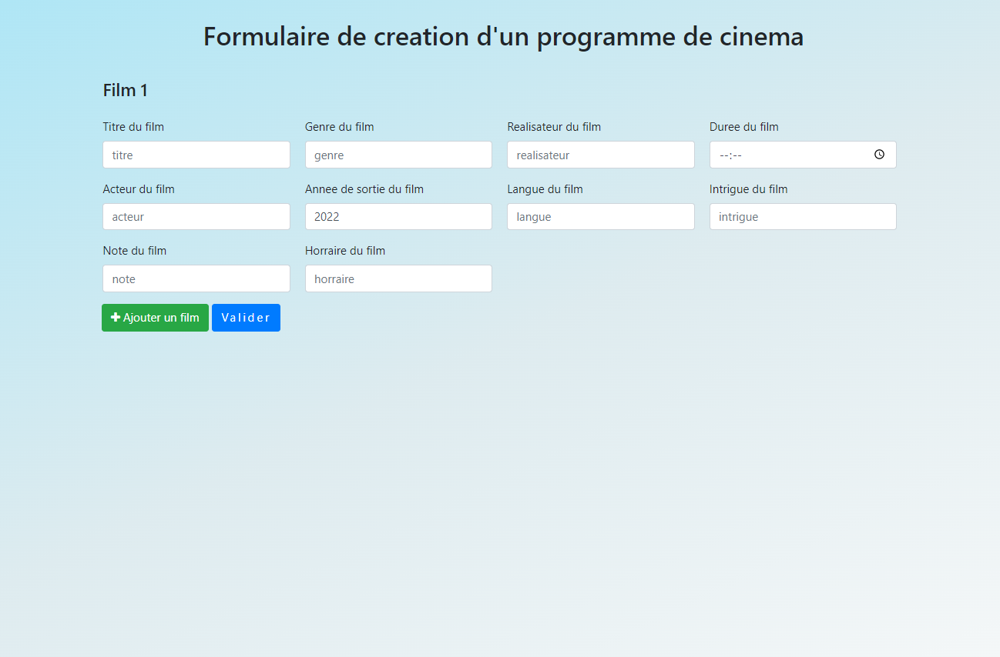
  
> On voit qu'on a la possibilité d'ajouter autant de films que l'on veut.

  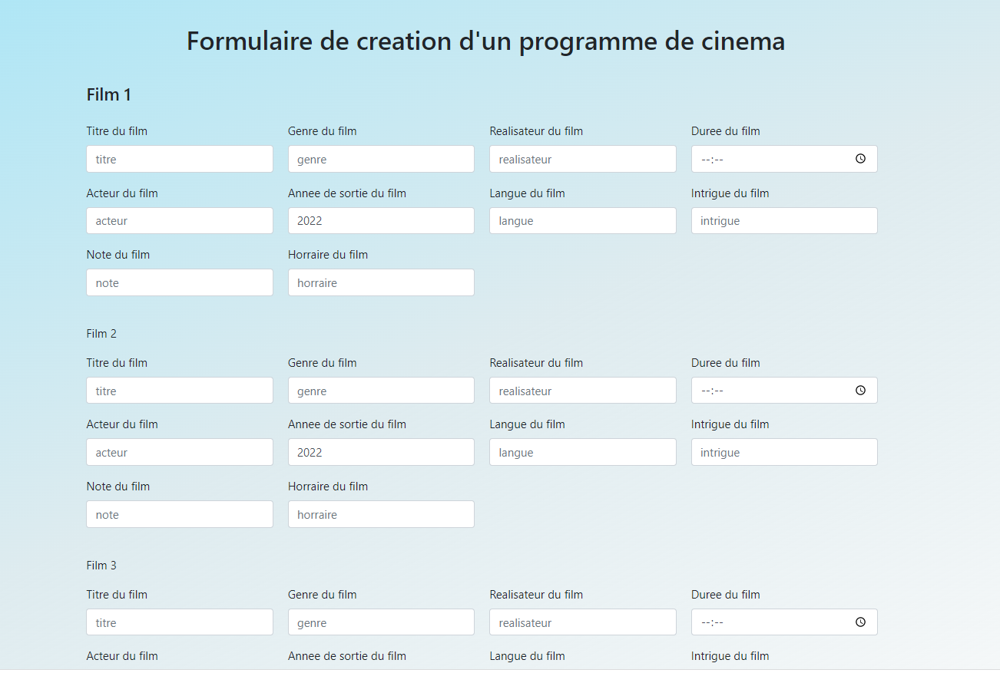
  
 > Lorsqu'on valide, on est redirigé vers la page d'affichage des programmes de cinéma. On en choisi un et on visualise la liste de ses films.
 
  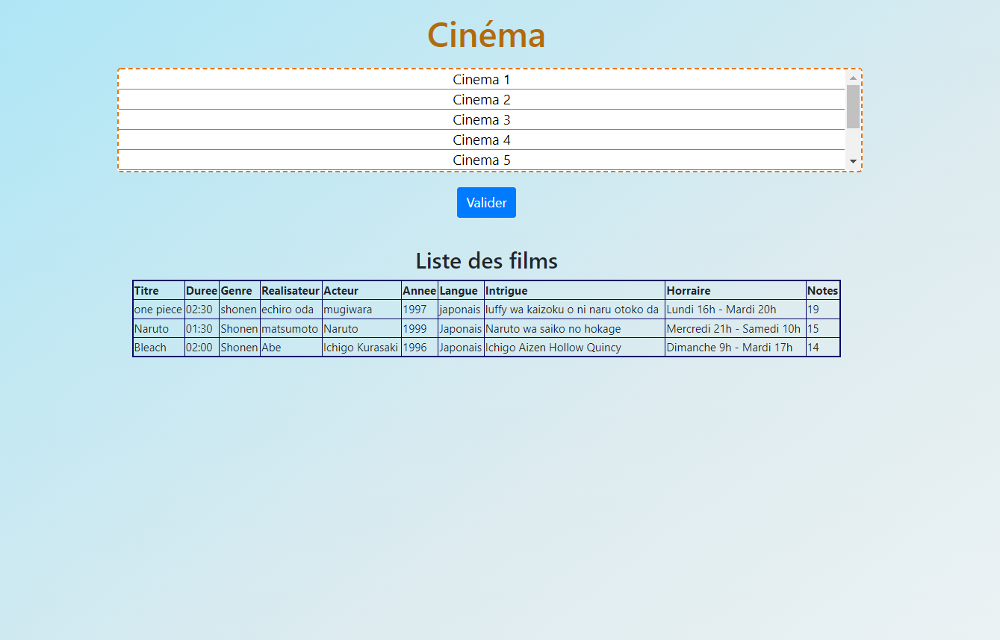
  
## Portail restaurant
> Ceci est le forumulaire de création d'un portail de restauration contenant plusieurs fiches avec les coordonnées, les menus et la carte de chaque restaurant.

  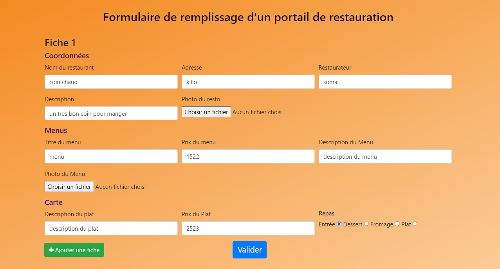
  
 > On voit qu'on a la possibilité de créer plusieurs fiches.
 
  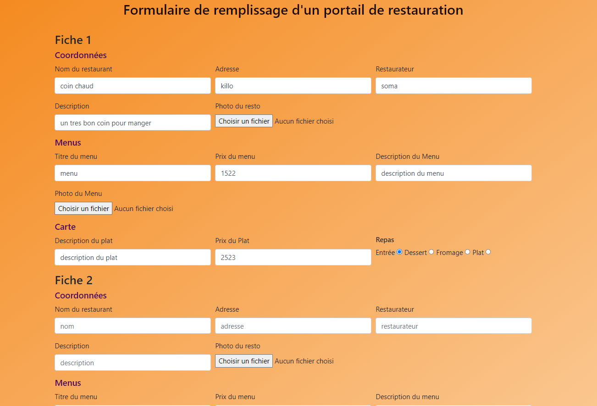
  
 > Après avoir rempli et valider le formulaire, on est redirigé vers la page où se trouve en détails la liste des restaurants avec leurs coordonnées, leurs meunus et leur carte.
 
  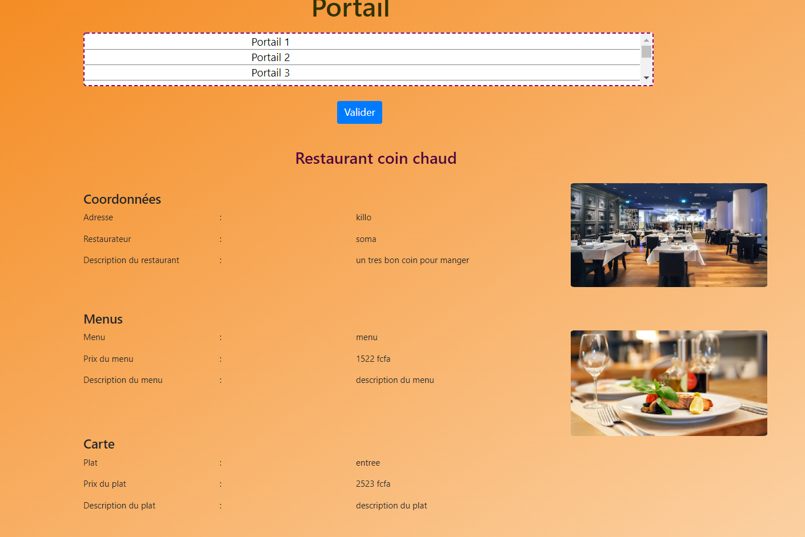

## Project Status 
      *Complete*

*****************
